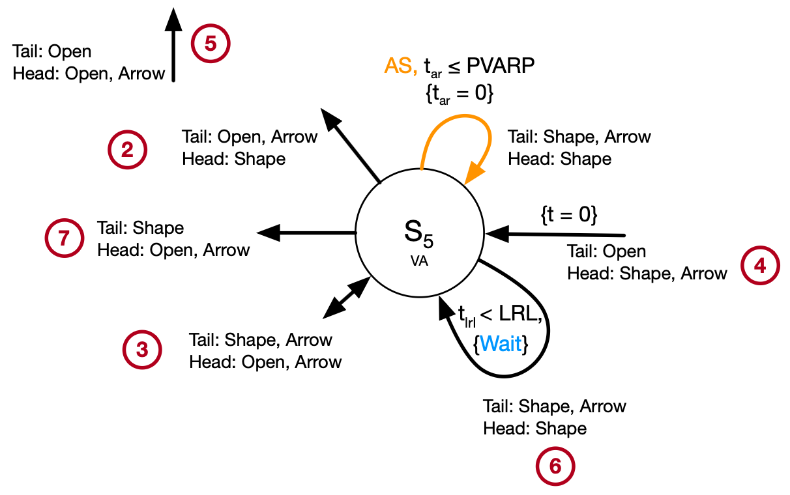
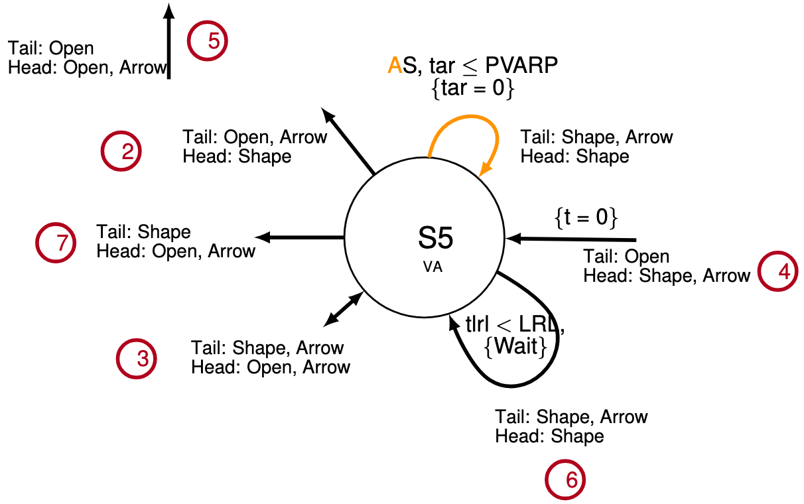

[]()  
  

# OmniToTikz 


OmniGraffle plug-in to export selection as a tikz graphic.

This automation does the best it can based on what's accessible through the OmniGraffle API. As such, all text is exported but most formatting is lost. I try to structure the tikz statement to ease the post export editing that adds back the formatting. 


OmniGraffle 7 Image       |  tikz Translation
:-------------------------:|:-------------------------:
  |  

Instructions for installation can be found on Omni's [website](https://omni-automation.com/omnigraffle/setup.html)

You may need to add some tikz libraries (```usetikzlibrary```) to your document. I've not run this in a bare document to compile the bare minimum list of libraries. I import a local tikzExtras.tex that loads a bunch of items.

## How to Use
* Select one or more items in drawing
* Select ```Export_tikz``` from the ```Automation``` menu
* Copy tikz code from the OmniGraffle Automation Console (Automation &rarr; Show Console). Code is enclosed by an ```adjustbox``` statement.

  
## What Works
* Exports all lines with color, opacity, weight, and arrows (straight and curved lines only)
* Exports all shapes with fill and stroke color and opacity, line weight, (rectangles and circles)
* Exports Text 
  * Some formatting (alignment, wrapping, font size)
  * If the first char has color, that char is colored. If the entire line was colored, still only the first in the tikz export.
  * Carriage returns are converted to tikz '\\\\' and text align set to match original drawing
  * If font used was Helvetica of any form, it will be set to Helvetica (phv) in the text node. Code able to translate others, just no other fonts in translation table
  * Handles standard unicode math chars though only greater than or equal and less than or equal are in table UNICODE_SWAP. Others can be added to table
* Single level of groups are supported (not group of group)

## What Doesn't Work
Lots of things but in particular:
* Bezier and Orthogonal lines
* Groups of groups
* Ignores dashed line format - all lines are solid
* Shapes that are not rectangles or circles
* Shadows
* Line ends other than an arrow
* Imported graphic images
* Selection of part of a drawing that includes lines connected to shapes not in the selection (e.g. going outside of the selection)
* Text
  * OmniGraffle API only provides the formatting of the first char. Therefore all text is formatted per the first char
  * Unknown unicode chars are expressed as a red ?. These need to be added to the translation table UNICODE_SWAP
  * Does not handle emojis
  * Font type other than helvetica is not carried over
* Saving to a file

## Notes
I use Zed as my editor for this work. If you want to play with the code in Zed you'll want to add the following to your ```settings.json``` file to get javascript code coloring:
```
  "file_types": {
  "JavaScript": ["omnigrafflejs"],
  }
```
For graphics foreground/background ordering I took a naive approach that the shape graphic ID defined relative positions between graphic items where lower numbers are closer to the foreground. I did not attempt the same with line objects so lines that ran under a shape will be in the foreground.

This work is based on the OmniGraffle 7 Omni [API](https://omni-automation.com/omnigraffle/OG-API.html#LineType)
